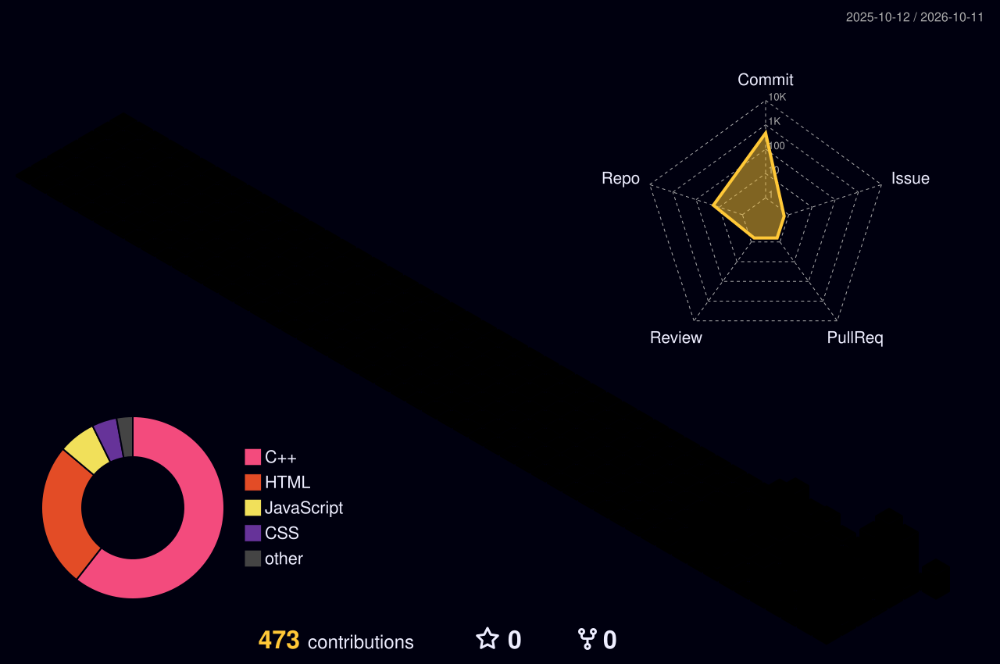

<!-- ✨ GitHub Profile README — Sneha Goyal -->

```text
███████╗███╗   ██╗███████╗██╗  ██╗ █████╗      ██████╗  ██████╗ ██╗   ██╗ █████╗ ██╗
██╔════╝████╗  ██║██╔════╝██║  ██║██╔══██╗    ██╔════╝ ██╔═══██╗╚██╗ ██╔╝██╔══██╗██║
███████╗██╔██╗ ██║█████╗  ███████║███████║    ██║  ███╗██║   ██║ ╚████╔╝ ███████║██║
╚════██║██║╚██╗██║██╔══╝  ██╔══██║██╔══██║    ██║   ██║██║   ██║  ╚██╔╝  ██╔══██║██║
███████║██║ ╚████║███████╗██║  ██║██║  ██║    ╚██████╔╝╚██████╔╝   ██║   ██║  ██║███████╗
╚══════╝╚═╝  ╚═══╝╚══════╝╚═╝  ╚═╝╚═╝  ╚═╝     ╚═════╝  ╚═════╝    ╚═╝   ╚═╝  ╚═╝╚══════╝
```

<h1 align="center">Hey, I'm <a href="https://github.com/sneha-goyal7" target="_blank">Sneha Goyal 👋</a></h1>

<p align="center">
  
</p>

---

### 💡 About Me

🎯 SDE focused on **real-time, high-throughput full stack systems** — the kind that sit underneath trading platforms, order engines, and portfolio dashboards.

💻 I build with the **MERN stack**, practice **DSA in C++** every day, and explore how LLMs can make developer tools smarter.

🌱 Currently strengthening my **full stack + Gen AI (RAG)** skills and shipping projects that solve real problems.

---

## 🌐 Connect

[](https://www.linkedin.com/in/goyal-sneha7)
[](mailto:snehagoyal4295@gmail.com)
[](https://github.com/sneha-goyal7)

---

## 🚀 Featured Work

<table>
<tr>
<td width="50%" valign="top">

**Codos — Online Judge Platform**
<br/>
React (Vite) · Node.js · Express · MongoDB · Docker

A LeetCode-inspired full-stack platform where users read problems, write code in the browser, and submit solutions. The backend compiles and runs **C++ and Python** inside a Docker container, grades against hidden test cases, and returns verdicts (Accepted / Wrong Answer / Execution Error). Secure auth with bcrypt + JWT.

[`View Repo →`](https://github.com/sneha-goyal7/Codos)

</td>
<td width="50%" valign="top">

**Git-PR-Assist — AI Pull Request Reviewer**
<br/>
React · Node.js · Express · Groq API · GitHub REST API

Paste any public GitHub PR link and get a plain-English summary of what changed, a code quality score out of 100, and a security scan for hardcoded secrets. Includes PR details and PDF export of the review report.

[`View Repo →`](https://github.com/sneha-goyal7/Git-PR-Assist)

</td>
</tr>
<tr>
<td width="50%" valign="top">

**Brewn — Cafe Ordering Web App**
<br/>
HTML · CSS · JavaScript

Responsive cafe ordering site with 30+ products, search and category/dietary filters, product-specific customization with dynamic pricing, a full cart, order types (dine-in / takeout / pickup), and a custom order confirmation screen. Built with accessibility and SEO in mind.

[`Live Demo →`](https://brewncafe.netlify.app/) · [`View Repo →`](https://github.com/sneha-goyal7/Brewn)

</td>
<td width="50%" valign="top">

**Kriya — [Project Title]**
<br/>
[Tech stack · e.g. React · Node.js · MongoDB]

[Write 2–3 lines about what Kriya does, the problem it solves, and its key features.]

[`View Repo →`](https://github.com/sneha-goyal7/Kriya)

</td>
</tr>
</table>

---

## 🛠️ Tech Arsenal

<div align="center">

**Languages**
<br/>


<br/><br/>

**Backend & Frontend**
<br/>


<br/><br/>

**Data & Caching**
<br/>


<br/><br/>

**Infra & DevOps**
<br/>


<br/><br/>

**AI & LLM**
<br/>


<br/><br/>

**Concepts**
<br/>


</div>

---

## 📊 GitHub Analytics

<div align="center">
  
  
</div>

<div align="center">
  
</div>

---

## 🧊 3D Contribution Graph

<div align="center">
  
</div>

<div align="center">
  
</div>

---

## 🏆 Achievements

- 🎓 Completed the **Full Stack Developer** certification on SimpliLearn SkillUp
- ☁️ Earned the **IBM SkillsBuild** completion certificate for the Gen AI & Cloud Computing internship (AICTE Approved, Bharat Cares Initiative)
- 🤖 Completed the **ChatGPT for Students** course under HCL GUVI's Bharat AI Initiative (powered by OpenAI), gaining practical proficiency in prompting techniques and responsible AI practices

---

<p align="center">
  
</p>

<!-- Crafted by Sneha Goyal -->
